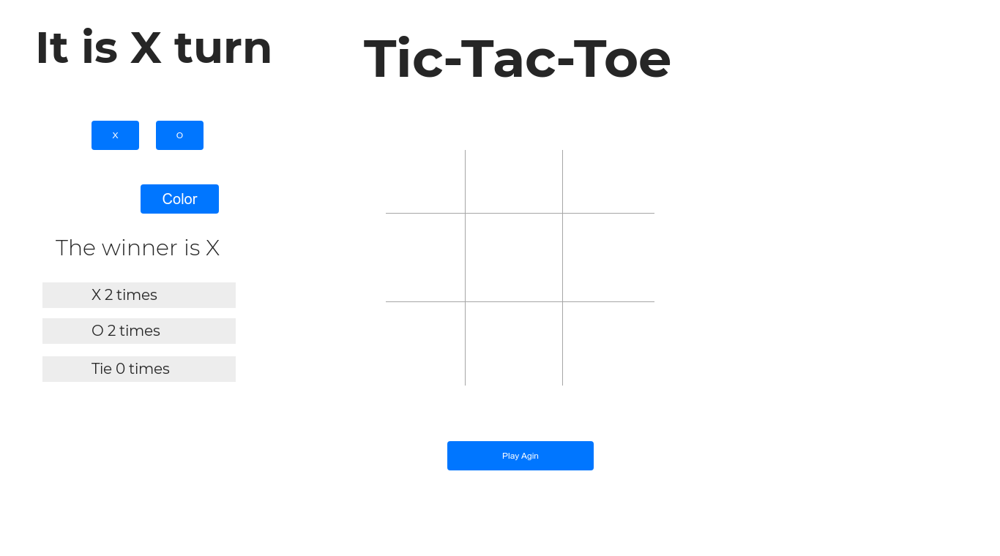

# Project #1: Tic Tac Toe
    It is a game for two players, X and O, who take turns marking the spaces in a 3×3 grid. The player who succeeds in placing three of their marks in a horizontal, vertical, or diagonal row wins the game.

# Contant:
    1. index.html:
            HTML file that contains all the element of the website:
                - <ul> tag that have 7 <li> which contains element that represent of the left side of th page.
                - 
 tag that have 9 neasted 
's to represent the 3x3 grid, and button to let the user play again.
                - Also, I connected the css and js files.

    2. style.css:
            CSS file that contains all the styles for the HTML by using the name tags, classes, id's.

    3. app.js:
            JavaScript file that contains all the function to make the game works:
                - start(): 
                    It is the starting function to give inisial values for everything in the game, then will call the cell();.
                - cell():
                    Contains forEach() method that call the function once for each element in an array in order by board array to put the X or O in each square.
                - clickEvent():
                    This function is called when each square clicked to make some change.
                - getWinner():
                    It is a function called to check who is the winner. I checked the winner by testing the all 8 cases.
                - xTurn():
                    This function is called when the user choose to start the game with X and it calls the start() again.
               - oTurn():
                    This function is called when the user choose to start the game with O and it calls the start() again.
                - watchColorPicker():
                    Will call when the user change the color for the background.

# Usage:

        To play the game this is the full srcren.

   On the left side it will give the user to customized the page by choose to start with X or O, and choose the background color.

     
        And in the main side you can see the 3x3 grid where you can start play by clicking the squares, but you will not be able to click in case of X or O win or if all squares have a value but no one win, alse if the square have a value you will not be able to click it again. And when you want to start again you can clikc Play Again button and it will let you play again without refreshing the page.

        As you can see in the screenshot you will be able to see a massage that show you who is the winner, alse how many times each player win and tie.

        And here how it will be when you put some X's and O's.

